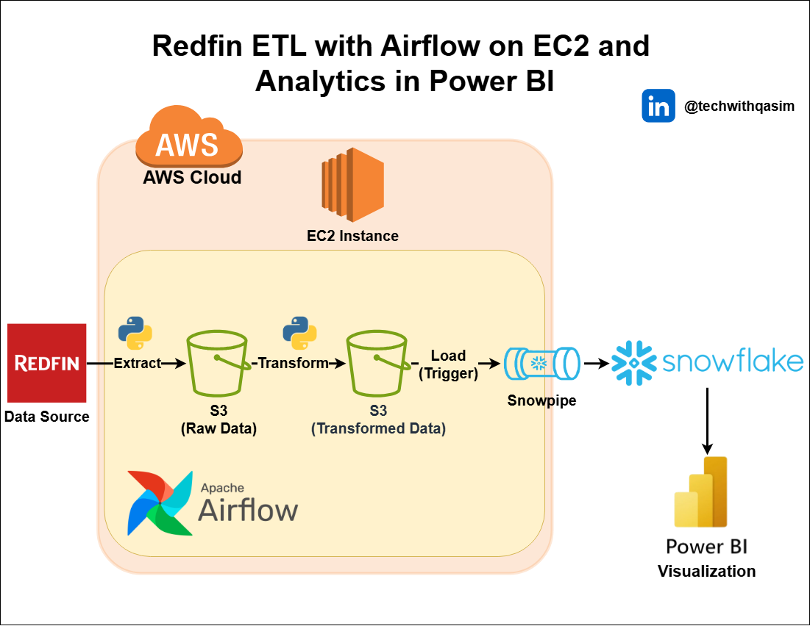

## Redfin ETL Pipeline with Airflow, AWS EC2, Snowflake, and Power BI

### **Overview**
This project demonstrates an ETL (Extract, Transform, Load) pipeline to extract data from Redfin, transform it using Python, and load it into Snowflake using Snowpipe. The pipeline is orchestrated with Apache Airflow running on an AWS EC2 instance. Visualization and analytics are performed in Power BI.

### **Architecture**

**Key Components**
- Redfin – Data Source
- AWS EC2 – Hosts Apache Airflow for orchestration
- AWS S3 – Storage for raw and transformed data
- Python – Extract and transform logic
- Snowflake – Data warehouse for analytics
- Power BI – Visualization and reporting tool